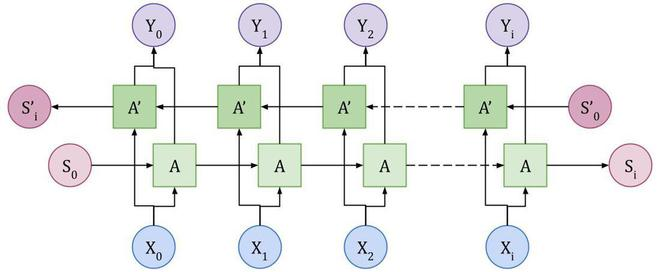

# Advanced sentiment analysis long short-term Memory (LSTM)

Emotion recognition project using IMDB dataset and PyTorch library. In this project, the neural network is trained to be able to recognize emotions in a text.

### The overall structure of the project:

1. Installation of required libraries for the project:
    * PyTorch -> for For neural network architecture design and training. 
    * torchtext -> For loading the IMDB database and creating a dictionary and other tasks
    * spacy -> To tokenize the words in the sentence

    ```
    pip install pytorch torchtext==0.6.0 spacy
    ```
    [install PyTorch for Cuda or other OS](https://pytorch.org/get-started/locally/)

2. Load the IMDB dataset and create a dictionary and prepare the data for neural network training:
    * Load tokenizer and create dictionary fields.
    * Download dataset using dictionary and tokenizer fields.
    * Separation of train and validation and test data.
    * Create a dictionary of words ***with the glove language model***.
    * Batching of data for neural network training.

3. Neural network architecture design:
    * Embedding layer -> This layer is to make the sentence structure easier for the network. ***which has an input equal to the number of dictionary words with an output.***
    * [LSTM](https://colah.github.io/posts/2015-08-Understanding-LSTMs/) layer -> Multiple LSTM layers to process a sentence that has input and output equal to the output of the embedding layer.
    * dropout -> Sometimes in neural network training, the network is [overfit](https://www.geeksforgeeks.org/underfitting-and-overfitting-in-machine-learning/). In other words, the network starts with data. Dropout is used to solve this problem. This will cause some neurons of the network to become inactive and those neurons will have no effect.
    * Fully connected or Linear layer -> This layer has the same input as the output of the RNN layer and outputs as many classes as desired. This layer is used to convert the RNN layer vector to the desired output.

### The structure of the LSTM network:
LSTM neural networks have branches similar to rnn networks. The main difference between the two networks is that the LSTM network has a long-term memory, which makes the network more accurate for long sentences.

[Recurrent neural network (RNN)](https://github.com/Eiliya-Zanganeh/Simple-Sentiment-Analysis-Recurrent-Neural-Network-RNN)

Bidirectional structure: In normal mode, processing in sentences starts with the sentence and ends with the end of the sentence. But in this structure, processing is from the first sentence to the end of the sentence and once again from the end to the first sentence.
The use of this structure makes the accuracy of the network higher, but the processing becomes heavier.
Note that by using this structure, the output vector of sentences is doubled due to processing the sentence twice.

1. Selection of loss function and optimizer and neural network training:
    * Load loss function [BCEWithLogitsLoss](https://pytorch.org/docs/stable/generated/torch.nn.BCEWithLogitsLoss.html) and [Adam](https://pytorch.org/docs/stable/generated/torch.optim.Adam.html) optimizer.
    * Network training with batches of training data and updating network weights with loss function and optimizer.
    * Evaluate the network in each epoch and find the value of loss and accuracy.
    * Final test of the model and save it.

Produced by [Eiliya Zanganeh](https://github.com/Eiliya-Zanganeh)